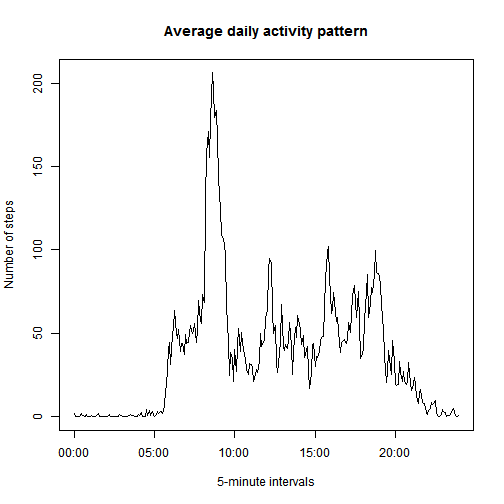

## Loading and preprocessing the data

Load the data from  *activity.zip* and transform the `date` and `interval` 
variables to their respective classes.

```r
data <- read.csv(unz("activity.zip","activity.csv"))
head(data)
```

```
##   steps       date interval
## 1    NA 2012-10-01        0
## 2    NA 2012-10-01        5
## 3    NA 2012-10-01       10
## 4    NA 2012-10-01       15
## 5    NA 2012-10-01       20
## 6    NA 2012-10-01       25
```

```r
data$date <- as.Date(data$date)
data$interval <- as.vector(data$interval, mode = "character")
for(i in 1:3){
        index <- nchar(data$interval) == i
        data$interval[index] = paste(rep(0,i), data$interval[index], sep = "")
}
data$interval <- strptime(data$interval, format="%H%M")
head(data)
```

```
##   steps       date            interval
## 1    NA 2012-10-01 2014-12-08 00:00:00
## 2    NA 2012-10-01 2014-12-08 00:05:00
## 3    NA 2012-10-01 2014-12-08 00:10:00
## 4    NA 2012-10-01 2014-12-08 00:15:00
## 5    NA 2012-10-01 2014-12-08 00:20:00
## 6    NA 2012-10-01 2014-12-08 00:25:00
```

## What is mean total number of steps taken per day?

Calulate the total number of steps each day and plot a histogram.

```r
daily_total <- tapply(data$steps, 
                      data$date, 
                      sum, na.rm = TRUE)
hist(daily_total,
     main = "Total steps taken each day",
     xlab = "Number of steps")
```

 

Calulate the mean and median total number of steps taken per day.

```r
mean(daily_total)
```

```
## [1] 9354
```

```r
median(daily_total)
```

```
## [1] 10395
```
> The mean total number of steps taken each day is 9354
> and the median total number of steps taken each day is 10395.

## What is the average daily activity pattern?

Calculate the average daily number of steps in 5-minute intevals and make a time
series plot.

```r
daily_avg <- tapply(data$steps, 
                    format(data$interval,"%H:%M"), 
                    mean, na.rm = TRUE)
plot(unique(data$interval), daily_avg, 
     main = "Average daily activity pattern",
     xlab = "5-minute intervals",
     ylab = "Number of steps",
     type='l')
```

 

Find the 5-minute interval that contains the maximum number of steps, averaged
across all days.

```r
rownames(daily_avg)[daily_avg==max(daily_avg)]
```

```
## [1] "08:35"
```
> 08:35 is the 5-minute interval
> that has the maximum number of steps on average.

## Imputing missing values

Calculate the total number of missing values in the dataset.

```r
na_index <- rowSums(is.na(data)) != 0
sum(na_index)
```

```
## [1] 2304
```
> There are 2304 missing values.

Impute missing values using the mean number of steps for that particular 
5-minute interval. Create a new dataset `data2` that contains the imputed 
missing values. 

```r
data2 <- data
na_interval <- format(data$interval,"%H:%M")[na_index]
data2$steps[na_index] <- daily_avg[na_interval]
head(data2)
```

```
##     steps       date            interval
## 1 1.71698 2012-10-01 2014-12-08 00:00:00
## 2 0.33962 2012-10-01 2014-12-08 00:05:00
## 3 0.13208 2012-10-01 2014-12-08 00:10:00
## 4 0.15094 2012-10-01 2014-12-08 00:15:00
## 5 0.07547 2012-10-01 2014-12-08 00:20:00
## 6 2.09434 2012-10-01 2014-12-08 00:25:00
```

Recalculate the total number of steps each day and plot a histogram. Also 
recalculate the mean and median total number of steps taken each day.

```r
daily_total2 <- tapply(data2$steps, 
                       data2$date, 
                       sum, na.rm = TRUE)
hist(daily_total2,
     main = "Total steps taken each day",
     xlab = "Number of steps")
```

 

```r
mean(daily_total2)
```

```
## [1] 10766
```

```r
median(daily_total2)
```

```
## [1] 10766
```
> The mean total number of steps taken each day is
> 10766 and the median total number of steps taken
> each day is 10766. These values are larger than 
> in the estimates in the first part of the assignment. Imputing the missing
> data inflated the estimates.

## Are there differences in activity patterns between weekdays and weekends?

Create a new factor variable in the dataset with two levels - "weekday" and 
"weekend" indicating whether a given date is a weekday or weekend day.

```r
daytype <- weekdays(data2$date)
daytype[daytype != "Saturday" & daytype != "Sunday"] <- "weekday"
daytype[daytype != "weekday"] <- "weekend"
daytype <- as.factor(daytype)
head(daytype)
```

```
## [1] weekday weekday weekday weekday weekday weekday
## Levels: weekday weekend
```

Calculate the average number of steps in 5-minute intevals taken on weekdays and
weekdends and make a panel plot of the respective time series.

```r
wkday_avg <- tapply(data2$steps[daytype == "weekday"], 
                    format(data2$interval[daytype == "weekday"],"%H:%M"), 
                    mean)
wkend_avg <- tapply(data2$steps[daytype == "weekend"], 
                    format(data2$interval[daytype == "weekend"],"%H:%M"), 
                    mean)

par(mfrow = c(2,1), mar = c(4.5, 4, 2, 2))
plot(unique(data$interval), wkday_avg,
     main = "Average daily activity pattern during weekday",
     xlab = "5-minute intervals",
     ylab = "Number of steps",
     type='l')
plot(unique(data$interval), wkend_avg,
     main = "Average daily activity pattern during weekend",
     xlab = "5-minute intervals",
     ylab = "Number of steps",
     type='l')
```

 

> There are differences in activity patterns between weekdays and weekends. 
> Average step activity during weekdays peaks significantly  in the morning
> at about 8:30am. This is not as significant over the weekend.
